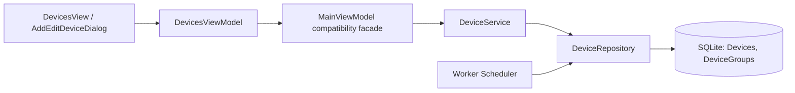
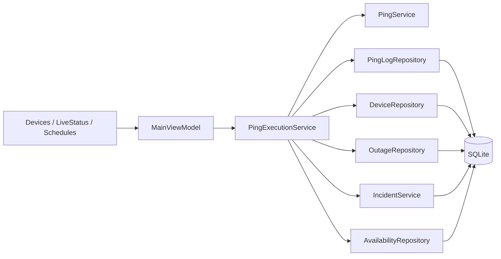
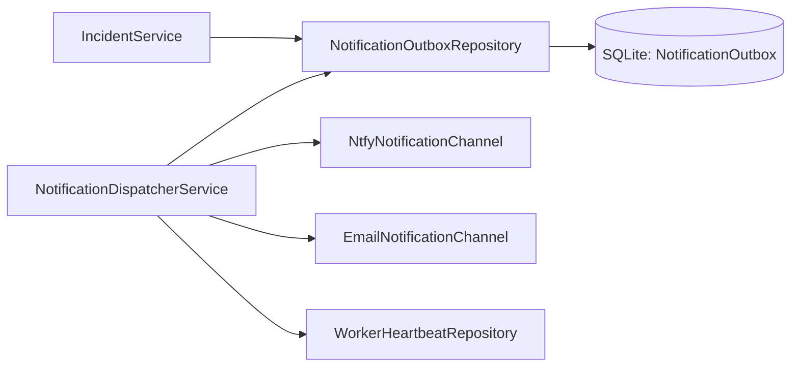
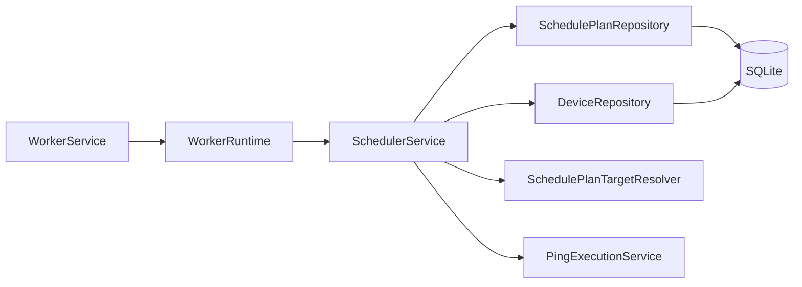
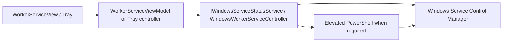
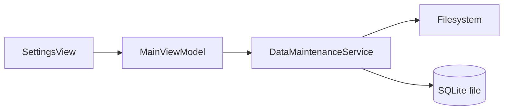
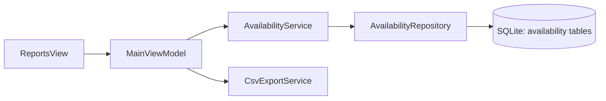

# Data Flows

Last reviewed: 2026-07-31

## Device CRUD

Save success closes the modal, reloads device collections, and the worker sees active devices on the next `GetAutoCheckCandidatesAsync` query. Validation errors remain in the modal through user-safe validation messages.

## Ping and Incident

`PingExecutionService` filters inactive, disabled, deleted and scheduled-paused devices before pinging.

## Notification Outbox

History screens read `NotificationOutbox`; they are not based only on log text.

## Scheduler

The UI can request plan run/start/stop through existing commands. The real recurring execution path is the worker-hosted scheduler.

## Worker Service Control

Startup type is read back from SCM. `Manual` maps to `DEMAND_START`; `Automatic` maps to `AUTO_START`.

## Backup and Restore

Restore creates a pre-restore backup and replaces the SQLite file. Safe worker stop/resume orchestration is not fully implemented in UI.

## Reporting

Current report grid uses availability data. Some named cards are route options over the same availability dataset; report-specific calculations need further extraction.

